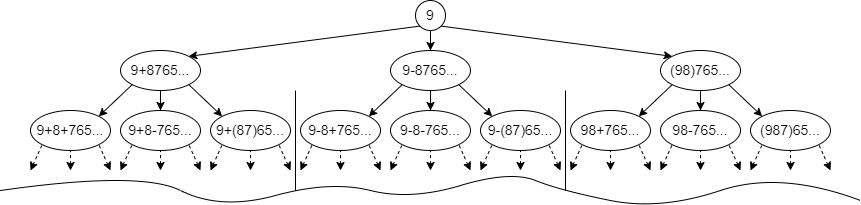
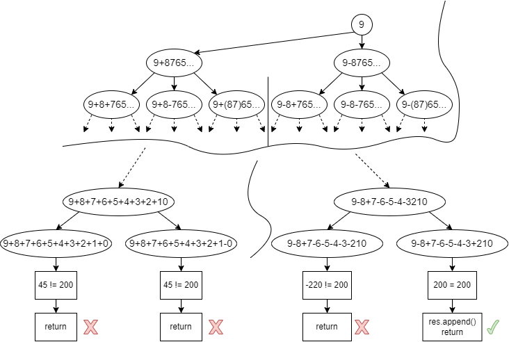

# Progmatic Lab assignment

## Contents

* Algorithm Idea
* Complexity
* Technical Details
* Contact

## Algorithm Idea

1) Input:
    * `num: str` - string of numbers from **9** to **0**. No repeating numbers and no non-numeric characters;
    * `target: int` - target value which the resulted expressions should evaluate to.
2) Output:
    * `res: list[str]` - list of expressions (strings) that evaluate to `target`. E.g. `'98+76-5+43-2-10'`.
3) Using **depth-first search** we form all possible expressions and store traversed nodes in `cur_res` variable (analogous to `seen` in many other traversal algorithms). Current number in a node is stored in `cur_str` variable. Traversal is pictured below below;

4) We store our current index in `cur_idx` variable. When `cur_idx == len(nums)` we have reached the lowest node and we evaluate the expression. If the expression equals `target` - we append it to `res` as pictured below;

5) While traversing the tree we also evaluate each node and store it in variable `cur_sum`. Reasoning for this will be discussed in the **Complexity** section below. Complimentary variable for `cur_sum` is `cur_num`, which is `int(cur_str)`;
6) To sum up, `dfs()` function for traversal should store:
    * `cur_idx` - where we in `num` currently, or current tree level in other words;
    * `cur_res` - list of traversed nodes, or traversal history;
    * `cur_sum` - currently evaluated expression.

## Complexity

* Time:
    * **O(N^3 * N)**. Backtracking has 3 branches (+, -, None), meaning **O(N^3)**. We also have Python's built-in `"".join(cur_res)` which is **O(N)**. If we have also used Python's `eval` function to evaluate the resulted expression at each final node level, we would have extra **O(N)** time. That is why we have stored the sum "on the fly" so we don't have to account for it.

* Space:
    * **O(N)** for storing traversed nodes.

## Technical Details

* `main.py` - entry point;
* Python 3.5+ min version;
* `black` for formatting;
* `mypy` for type hints.

## Contact

[Telegram](https://t.me/SXRu1)
[Gmail](mailto:slavaitru@gmail.com)